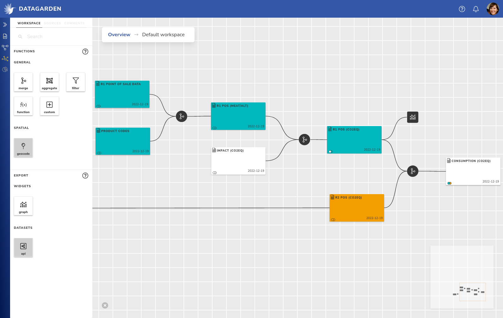

# DataGarden

DataGarden is an end-to-end encrypted data collaboration platform.

## Overview

DataGarden allows you to share and analyse data securely, with an emphasis on gaining insights on data that is owned by
different parties. DataGarden is structured around the building of workflows, visually, with built-in controls to manage
data ownership and privacy. The results from your data analysis can be dynamically embedded into a report, and shared
publically with a simple URL. Finally, this can all be done from the comfort of your browser, no deployments necessary.

### Why?

- **Collaborate in your own private data space**. The end-to-end encryption (E2EE) ensures that everything in the data
    space remains yours and never leaves your device unencrypted.
- **Realtime**. DataGarden was designed for realtime collaboration from the start, which means that everything is
    immediately and smoothly synced to the other collaborators.
- **Keep your pivate data private**. Data is not shared by default, not even with your fellow collaborators. Only share
    what data you deem relevant through the use of detailed privacy and access controls. If sensitive data has to be
    shared anyways, create a safe, synthetic copy of your data first, so that no real data ever leaves your device.
- **Create reproducible workflows, visually**. Our visual pipeline builder removes the need for programming experience,
    whilst providing similar reproducibility. Additionally, the canvas intuitively enables you to organise the data
    flows such that each step is documented properly.
- **Share your results**. Create reports using our WYSIWYG reporting tool, and link charts that are updated
    automatically when the data changes.
- **Deployment free**. Everything happens in the browser, removing the need to deploy and maintain anything complex
    yourself, or to have to install anything on your computer.

### Links
- [Documentation](https://docs.datagarden.app)
- [Homepage](https://datagarden.app)

### Screenshots

