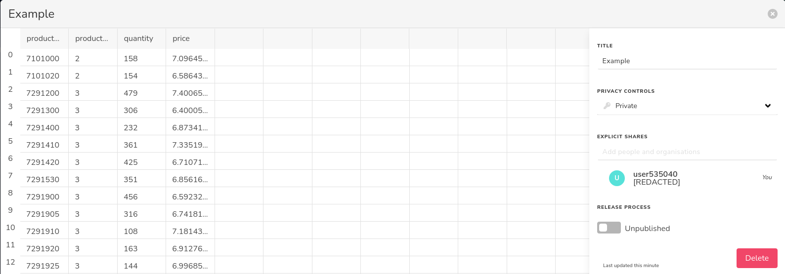
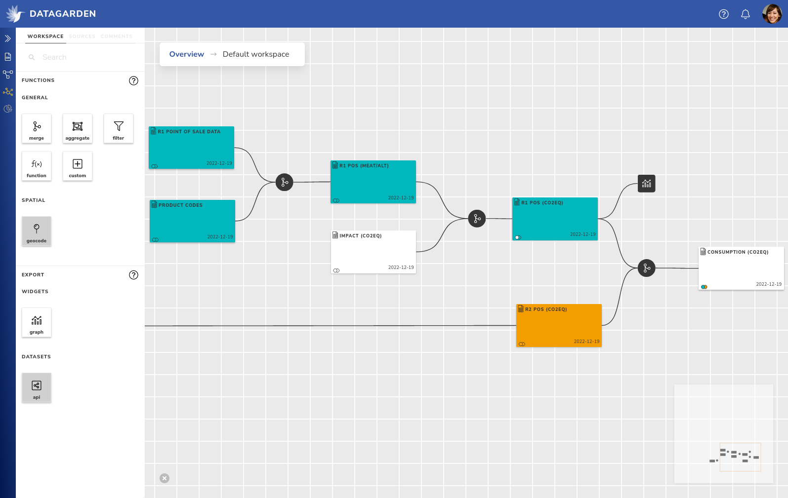

# Overview

The anatomy of a data space roughly consists of the following components:
- a place to upload and manage data [**sources**](#sources),
- the [**workflow builder**](#workflow-builder) to wrangle and analyse these sources,
- and a [**reports**](#reports) builder to disseminate and share results.

In DataGarden, the sidebar on the left contains links to these components. We will only handle a subset to get going,
for more information on the other components you can consult the reference manual.

## Sources
To get started, some data will have to be uploaded to the data space. One of the core principles of DataGarden is **data
reproducibility**. This means that all operations that are done on data must be persisted somewhere: a quick edit here
and there are disastrous in the long run, because the information and knowledge on what was there originally is lost.
This is why we encourage that data is uploaded as close to its original state as possible, without any filtering or
editing beforehand.

Uploading your source data without filtering out sensitive information is not desirable for most online applications,
but in DataGarden all data is **end-to-end encrypted**, and your source data never leaves your device unencrypted. On
top of that, the dataset is not shared with your data space members by default either.

> When you upload a dataset, each column is encrypted with its own seperate key. Only when you share a column with a
> collaborator will they gain access to the key. The server never sees any of the keys. Learn more about data encryption
> [here](../encryption.md).

Once you have uploaded a dataset, you will be greeted by a preview of your data. Note the use of the word *preview*: you
will not be able to click on a cell and manually edit the data value. This would, once more, violate the principle of
data reproducibility. Instead, your data source can be published, enabling its use in the workflow builder.

*Img 1: Source table preview*

Before we move on to the workflow builder, a quick note on access controls. By default, the source is only available to
yourself. You can choose to grant access and share certain columns to other collaborators. First, you should invite them
to the source as a whole, enabling them to even see the existence of this source, by typing their name or email in the
dropdown on the right called *explicit shares*. Once they are part of the source dataset, you can give them access to
individual columns by clicking on a column header, and dragging them to *full access*.

Once shared, everyone that has access to a column retains this access even when new datasets are created from this
source. But we are getting ahead of ourselves, let's first build a simple workflow.

## Workflow builder
The main view of DataGarden is the workflow builder (see image 2). From here, you will start working with your and your
collaborators data. If this is a new data space, you will be presented with an empty canvas, but you can quickly make it
your own!

*Img 2: Workflow builder*

A **workflow** consists of data **collections** (the large colourful rectangles), that are modified, edited, filtered,
aggregated, etc. by **transformers** (small black circles). Workflows are built from left to right, with the leftmost
data collection being one of your data sources. You can drag them in from the *sources* tab in the workspace panel if
they were ready to be published.

Collections allow you to preview what the data looks like at that stage of the workflow, and to alter what data is
shared with whom. To change, or *transform*, the data, you can drag in a transformer from the *workspace* tab, and
connect it to the output of one of your collections.

Some transformers, such as the merge transformer, need multiple inputs, but most are ready to be used after connecting
just one source to it. Once you've connected it a collection, you can click on it to edit its functionality. For
example, with the *filter transformer*, you can filter some rows based on a condition, and with the *function
transformer* you are able to build a formula similar to spreadsheet editors.

Every transformer will showcase the incoming data on the left, and a live preview of your changes on the right. If you
are satisfied with the changes, you can save or *commit* them. This will save your changes, but also send them to any
other collaborators to compute any columns that you maybe did not have access to. Ones everything is complete, a new
collection is created with the results, and you can continue building your workflow.

Finally, there is one more component called a **widget**, which does not produce any new collections and instead is the
final stop in your *data pipeline*. Widgets can output result data in any number of ways. For example, a chart widget
can create a chart such as a histogram from your data and allow that chart to be used in reports.

## Reports
While building a data workflow is a lot of fun, at one point you want to start sharing any insights. The reports page
allows you to create both internal and public reports. Public reports can be shared such that the viewer does not need a
DataGarden account.

Building a report is very straightforward. It consists of *sections*, where each section can either be content through
the form of rich text, or a widget / chart. Sections can be easily rearranged by dragging them to their desired position, or
removed alltogether. Text sections support common markup and alignment, and will show a live preview of what you are
editing. Widgets cannot be edited from the report itself, as they are managed by the workflow builder, which also takes
care of keeping the data up to date.

